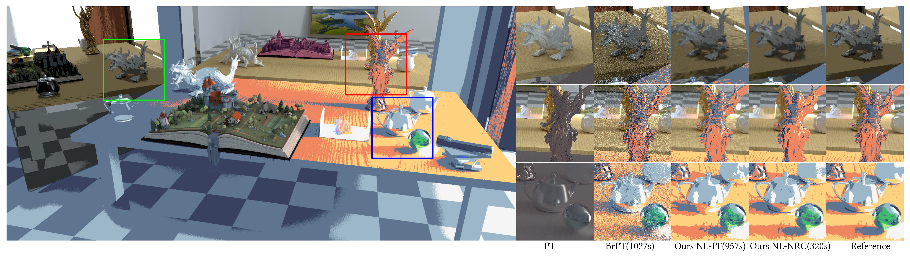

# Practical Stilzed Nonlinear Monte Carlo Rendering
This is an early access version of the SIGGRAPH 2025 paper ["Practical Stilzed Nonlinear Monte Carlo Rendering](https://cs.uwaterloo.ca/~xtong/assets/pdf/practical-stylized.pdf)


The code is based on [AkariRender](https://github.com/shiinamiyuki/akari_render). The main files are:
- [lm_path_filtering.rs](crates/akari_integrator/src/lm_path_filtering.rs)  The implementation of nonlinear path filtering (NL-PF).
- [nrc_pt.rs](crates/akari_integrator/src/nrc_pt.rs) The implentation of nonlinear neural radiance caching (NL-NRC).
- [svm/surface/mod.rs](crates/akari_render/src/svm/surface/mod.rs) The implementation of various nonlinear stylization shader nodes.
## Build
First clone the project, make sure to enable LFS:
```bash
git clone --recursive https://github.com/LuisaGroup/practical-stylized
```
If you are using < Windows 10, please upgrade to Windows 10 or above.
- Rust 1.81.0+
- CMake > 3.23
- Ninja
- Clone Blender 4.0 source code from `blender-v4.0-release` branch
- Put path to blender source in `blender_src_path.txt` at project root

To run on CPU, the following runtime requirement must be satisfied:
- clang++ in `PATH`
- llvm dynamic library of the same version (for Windows users, it is the `LLVM-C.dll`.
) should be in `PATH` as well.

## Run
Running the NL-NRC requires a CUDA-enabeld GPU. The other methods can run on CPU or GPU.
Download the scene file from release tab and put `Scene.bin` under `scenes/veach-ajar-sty-v2/`.
To produce render the scene in the teaser:
```bash
DEVICE=cuda
cargo run  --release --bin akari-cli -- -s scenes/veach-ajar-sty-v2/scene-sty.json -m configs/teaser/pt.json -d $DEVICE --gui
cargo run  --release --bin akari-cli -- -s scenes/veach-ajar-sty-v2/scene-sty.json -m configs/teaser/brpt.json -d $DEVICE --gui
cargo run  --release --bin akari-cli -- -s scenes/veach-ajar-sty-v2/scene-sty.json -m configs/teaser/nl-pf.json -d $DEVICE
cargo run  --release --bin akari-cli -- -s scenes/veach-ajar-sty-v2/scene-sty.json -m configs/teaser/nl-nrc.json -d $DEVICE --gui
```

